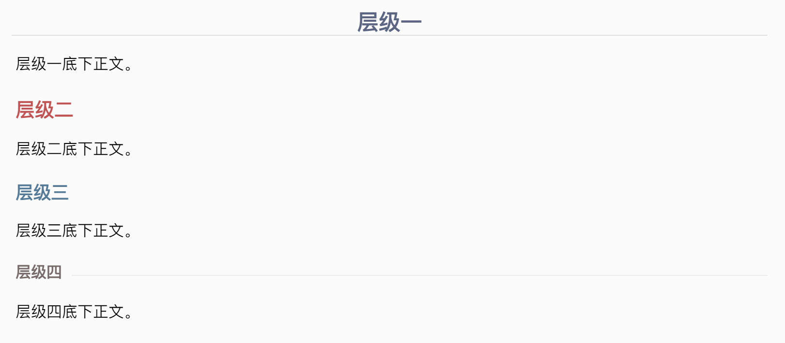
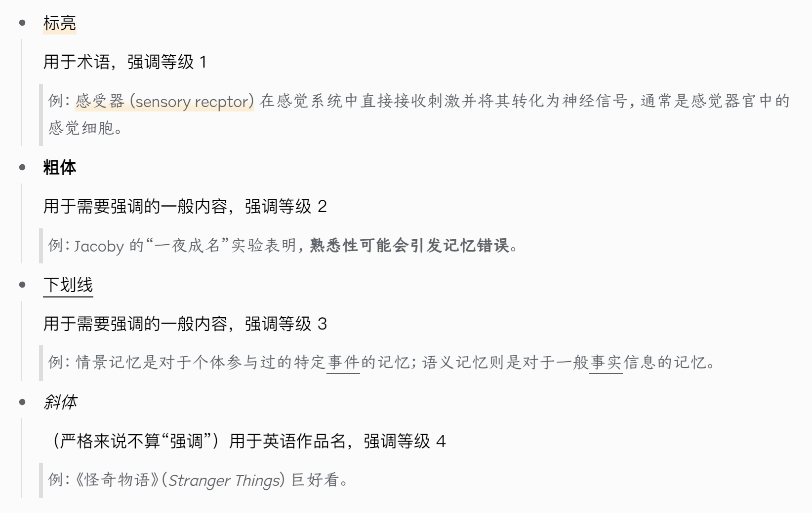
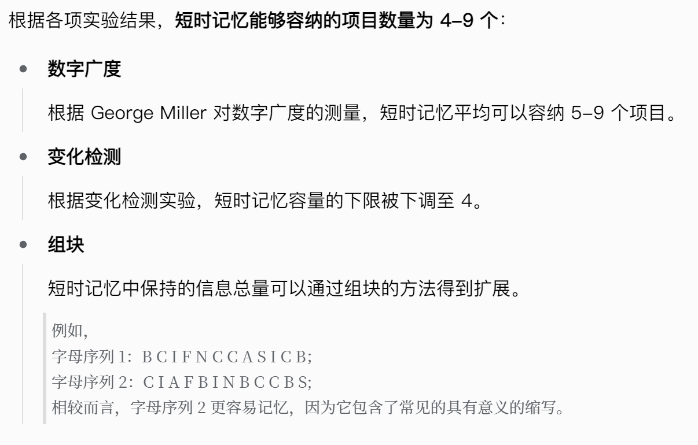
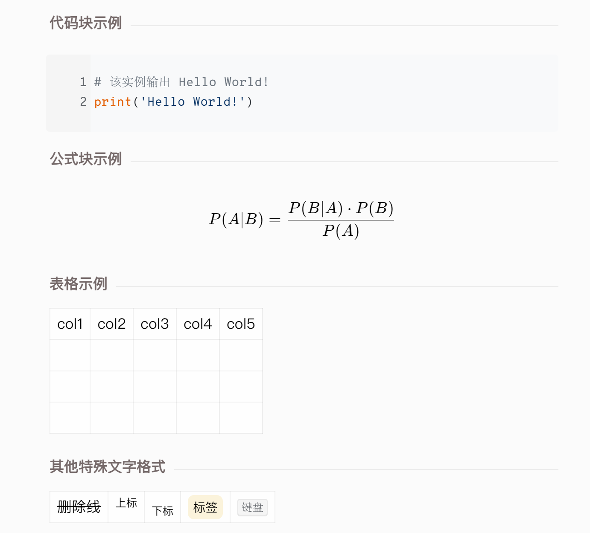

# 学习笔记模板

文中所用软件为思源笔记，主题为 Oir-Light

## 1. 标题层级

最多只用四层标题；因此 **h5 和 h6 都没有特别指定样式**，如果有需求可以自行更改。

## 2. 正文内容

### 2.1 标记

对内容的标记涉及到标亮、加粗、下划线和斜体（**对内容的强调程度由强至弱**）

### 2.2 列表

有的人可能习惯于每一个段落都用列表的形式呈现，我比较喜欢完整的正文，所以对列表的使用也会有所规范。主要注意以下几点：

1. **内容**

    列表一般用于比较离散的信息，比如不同的类别、程度、过程、脉络等，这些信息如果不以无序列表或有序列表的形式展开可能会影响直接阅读的流畅性。
    
2. **形式**

    列表前的正文内容应带有冒号“：”，代表列表内容是前文的展开；每段列表以概括性语言为首，视情况而定需不需用到标记，并在下拉的拓展部分完善内容。具体效果如图。
    
    
    
3. **特殊情况**

    如果行文内容紧凑而不离散，但是整体实在有碍美观、影响阅读，也可以用列表来整理。这种情况应视为特殊情况，能避免则避免，不然规范就没意义了。
    
4. **求生欲**

    喜欢全文用列表的可以无视这些规范，一切以自己的习惯为准。

### 2.3 引述框

引述框主要有两点作用：

* **引述**

  > “引述框是用来引述的！”——原教旨主义者
  >
* **其他功能**

  引述框除了引述以外你也可以依据自己的喜欢来实现其他功能。

  > 例如：我就喜欢用引述框来举例子；而且一般只用于举例子——哪有那么多话要引述……

### 2.4 其他

其他的功能就按照自己的喜好随意使用即可，没什么特别的规范。

